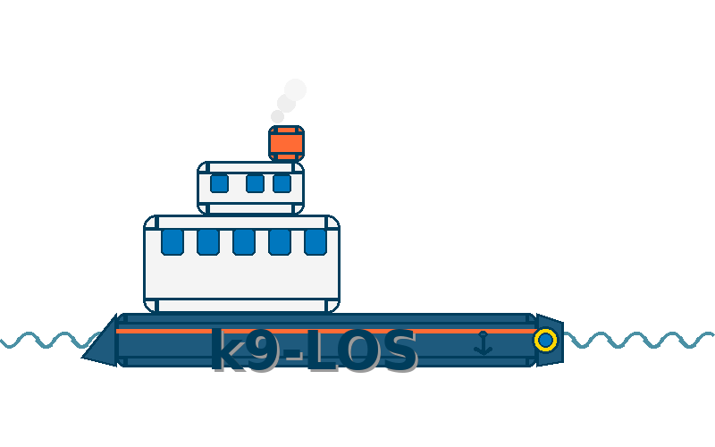

# k9-los-api
K9-los håndterer oppgave- og ledelsesstyring i k9. k9-sak, k9-tilbake og k9-punsj produserer hendelser som krever manuell interraksjon fra saksbehandler. K9-los produserer statistikk for å dekke behovet for oppgavestyring.

Oppgavestyrere definerer kriterier som ligger til grunn for køer som fordeler oppgaver etter prioritet til saksbehandlere.

LOS er strukturert etter "package-by-feature".

# Bygge og kjøre lokalt

1. Start k9-verdikjede. Er avhengig av vtp, postgresql og azure-mock.

2. Trenger `gpr.user` & `gpr.key` i gradle.properties for å laste ned dependencies.

**I MacOS: ~/.gradle/gradle.properties**
```
gpr.user=<Ditt brukernavn på github>
gpr.key=<DIN GIT PAT>
```
Skape en PAT <a href="https://docs.github.com/en/authentication/keeping-your-account-and-data-secure/creating-a-personal-access-token">her</a> med read packages scope. 

3. Start klassen `no.nav.k9.los.K9LosDev` med vm-options

`-Djavax.net.ssl.trustStore=/Users/.../.modig/trustStore.jks -Djavax.net.ssl.keyStore=/Users/.../.modig/keyStore.jks -Djavax.net.ssl.trustStorePassword=changeit -Djavax.net.ssl.keyStorePassword=devillokeystore1234`


