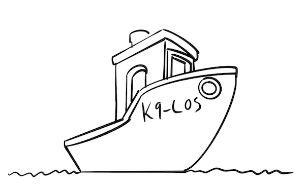

# k9-los-api
K9-los håndterer oppgave- og ledelsesstyring i k9. k9-sak, k9-tilbake og k9-punsj produserer hendelser som krever manuell interraksjon fra saksbehandler. K9-los produserer statistikk for å dekke behovet for oppgavestyring.

Oppgavestyrere definerer kriterier som ligger til grunn for køer som fordeler oppgaver etter prioritet til saksbehandlere.

LOS er strukturert etter "package-by-feature".

# Arkitektur
Los mottar hendelser fra fagsystemene i k9: K9-sak, K9-klage, K9-tilbake (fptilbake) og K9-punsj. Hendelsene blir 
mellomlagret i en eventjournal før den blir transformert og lastet inn i en k9-agnostisk oppgavemodell.
Oppgavemodellen en en key-/value store med basisfunksjonalitet for reservasjon, status (åpen/lukket mm.), mens innholdet
i key-/value storen er basert på en json-spesifikasjon som lastes inn i applikasjonen ved oppstart. Systemet har også 
støtte for at alt bortsett fra oppgavemodellen bor i separate applikasjoner som laster inn spesifikasjoner og
oppgavedata via REST, men dette er p.t. sovende funksjonalitet.

# Arbeidsflyt
- Los kan motta hendelsesmeldinger fra fagsystemer som vil melde inn arbeidsoppgaver, enten via REST eller Kafka.
    - Ved REST-mottak blir meldingen validert mot en oppgavespesifikasjon og lagret i oppgavemodellen.
    - Ved Kafka-mottak blir meldingen lagret i en eventjournal, og deretter plukket opp av en eventtiloppgave-prosess som transformerer meldingen til en oppgave i oppgavemodellen.
- Meldingene må inneholde:
  - en oppgavespesifikasjon-ID som identifiserer hvilken type oppgave det er snakk om.
  - en ID som identifiserer feks behandlingen oppgaven skal representere. (ekstern ID)
  - en streng som identifiserer versjonen av oppgaven (ekstern versjon), og som lar los avgjøre en kronologi. Oppgavemodellen bruker rekkefølgen ved innsending for å bestemme kronologien, men eventjournalen for K9 tolker versjonsstrengen som en timestamp.
    - Denne strengen blir også brukt som idempotensnøkkel for å unngå at samme melding blir prosessert flere ganger.
    - Det er dermed også et krav om at ekstern versjon må være unik for en gitt ekstern ID.
- Los har utover dette ingen krav til hvordan meldingene skal se ut, annet enn at de må inneholde nok informasjon til å kunne mappe dem til en oppgitt oppgavespesifikasjon.
- Det er derimot en de-facto standard for hvordan meldingene ser ut, som har blitt felles oppførsel for mottaksapparatet i k9-adapteret.
  - Meldingene burde være full snapshot av alle relevante opplysninger for oppgaven. Vi har en "plan b" for mangelfulle meldinger, hvor vi kan hente opplysninger fra fagsystemet (via en REST-callback) for å komplettere oppgaven, eller utlede felter fra tidligere innsendte meldinger for en oppgave (Dette kaller vi sticky-felter). Disse variantene er ikke ønskelige, men fungerer som nødløsning.
  - Dersom det er behov for opprydning eller andre korreksjoner, kan meldingen få eventhendelsestypen satt til VASKEEVENT. Når en slik melding prosesseres vil den overskrive verdier på foregående versjon av oppgaven.
    - Vaskeeventer brukes feks til opprydning når vi finner diff ved avstemming, eller hvis vi vil henlegge behandlinger som har blit feilopprettet.

# Interne arbeidsprosesser
- Kafkalyttere (domeneadaptere.k9.eventmottak) mottar hendelser fra fagsystemene og lagrer dem i en eventjournal, og kaller deretter korresponderende oppgaveadapter.
- Oppgavevaktmester (definert i K9Los.kt, under planlagte jobber er en prosess som leter etter meldinger som har feilet ved innlasting i oppgavemodellen, og prøver å laste dem inn på nytt.
- Historikkvaskvaktmester (definert i K9Los.kt, under planlagte jobber) er en prosess som leter etter historikkvaskbestillinger og prosesserer disse.
  - En historikkvask er en rekjøring av tidligere innlastede meldinger for en gitt ekstern ID, for å rette opp feil.
  - En historikkvask vil rekjøre mappinglogikk og overskrive oppgaveverdier, og kan dermed bruke korrigert kode til å utlede nye verdier og overskrive disse.
  - Dersom oppgaveadapter oppdager at meldinger har blitt sendt inn fra fagsystem i feil rekkefølge, vil også en historikkvask bestilles for å rydde opp.
- Oppgavestatistikksender (definert i K9Los.kt, under planlagte jobber) er en prosess som periodisk ser etter usendte oppgavedata for å sende statistikk til datavarehus.

# Pakkestruktur, viktige pakker
- Los etterstreber at all logikk som er spesifikk for K9 ligger i pakken domeneadaptere.k9. Herunder ligger:
  - Avstemming - Tjenester som sjekker beholdningen av åpne oppgaver opp mot tilsvarende unit of work (som regel en behandling) i korresponderende fagsystem.
  - Eventmottak - Kafkalyttere og journal for mottatte hendelser.
  - Eventtiloppgave - Adapterlogikk som konverterer hendelser til oppgaver i henhold til sine oppgavespesifikasjoner pr fagsystem.
  - Refreshk9sakoppgaver - Tjeneste som trigger innhenting av registeropplysninger i k9-sak på behandlinger som det er sannsynlig at saksbehandlere vil gå inn på. Dette for å redusere ventetid i skjermbilder.
  - Statistikk - Tjeneste som pusher statistikkmeldinger til datavarehus for oppgavestatistikk.
- Pakken mottak har ansvar for innlasting av oppgavespesifikasjoner og mottak av oppgaveDTOer som blir validert opp mot spesifikasjonene. 
- Pakken query muliggjør søk i oppgavemodellen via en requestmodell som valideres mot oppgavespesifikasjoner og bruker spesifikasjonene til å generere en SQL-spørring for å søke. Denne pakken brukes av køer, lagrede søk, uthenting av statistikkdata til skjermbilder, osv.
- Pakken ko er tjenesten for å forvalte oppgavekøer. Saksbehandlere kan be om arbeidsoppgaver fra køer, og reservere de så de ikke er synlige for andre køer/saksbehandlere.
- Søkeboks er en enkel tekstboks i skjermbilder for å søke etter enkeltsaker basert på fødselsnummer, saksnummer og tilsvarende identifikatorer.
- Reservasjon har ansvar for å håndtere reservasjon av oppgaver på saksbehandlere.
- Visningoguttrekk har ansvar for å hente ut oppgavedata for visning og andre formål basert på oppgaveIDer returnert av feks oppgavequery.

# Bygge og kjøre lokalt

## Forutsetninger

### Maven
Prosjektet bruker Maven som byggesystem. Sjekk at Maven er installert:
```bash
mvn --version
```

### GitHub Packages Autentisering

Siden prosjektet bruker private NAV-pakker fra GitHub Packages, må du sette opp autentisering. Se https://github.com/navikt/k9-verdikjede/tree/master/docs/utvikleroppsett

## Bygge prosjektet

```bash
# Bygg med tester (krever Docker)
mvn clean package

# Kun kjøre tester (krever Docker)
mvn test
```

**📝 Note om tester**: Prosjektet bruker TestContainers som krever Docker. Hvis du ikke har Docker installert/kjørende, bruk `-DskipTests` flagget. Se [TESTING_GUIDE.md](TESTING_GUIDE.md) og [QUICKSTART.md](QUICKSTART.md) for mer informasjon.

Etter bygging finner du:
- `target/app.jar` - Applikasjonen (3 MB)
- `target/lib/` - Alle avhengigheter som separate JAR-filer (196 stk)

## Kjøre lokalt

1. Start k9-verdikjede. Er avhengig av vtp, postgresql og azure-mock.

2. Start klassen `no.nav.k9.los.K9LosDev` med vm-options:
```
-Djavax.net.ssl.trustStore=/Users/.../.modig/trustStore.jks 
-Djavax.net.ssl.keyStore=/Users/.../.modig/keyStore.jks 
-Djavax.net.ssl.trustStorePassword=changeit 
-Djavax.net.ssl.keyStorePassword=devillokeystore1234
```

Eller kjør direkte med JAR:
```bash
java -jar target/app.jar
```

