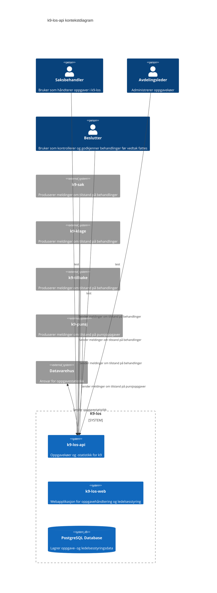

Søk:
 - kriterier
 - uttrekksnøkkel

Kø:
 - kriterier
 - rapportkriterier
 - saksbehandlere
 - antall (hentet dynamisk/cachet)
 - uttrekksnøkkel

Treig kjøringsresultat:
 - nøkkel
 - data
   - Oppgaveentitet
     - metadata (status, andre first class citizens) //under tvil
     - verdier (utplukk fra KV)

