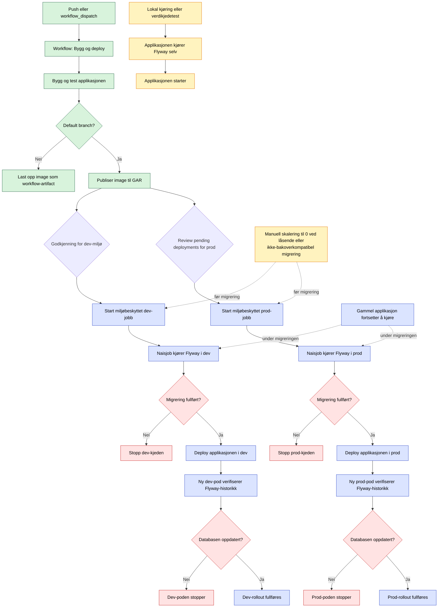

# Databasemigrering og deploy

## Egenskaper ved flyten

- Flyten tilsvarer master, men hver appdeploy avhenger av en migreringsjobb for samme miljø og image.
- Dev- og prodløpet starter uavhengig av hverandre etter build, som på master.
- Migreringsjobben bruker admin-rollen og kjører Flyway.
- Migrering og appdeploy ligger i samme miljøbeskyttede jobb. Én `Review pending deployments`-godkjenning åpner begge stegene, og ingen av dem kjører før godkjenningen.
- Applikasjonen kan ikke migrere i dev eller prod. Den validerer historikken og stopper ved ugyldige eller ventende migreringer.
- Lokalt og i verdikjedetester kjører applikasjonen selv Flyway før oppstart.
- Den gamle applikasjonen fortsetter å kjøre under en bakoverkompatibel migrering.
- Flyten kan ikke avgjøre om en migrering er bakoverkompatibel. Ved behov må gamle podder skaleres til 0 manuelt før migreringen starter.
